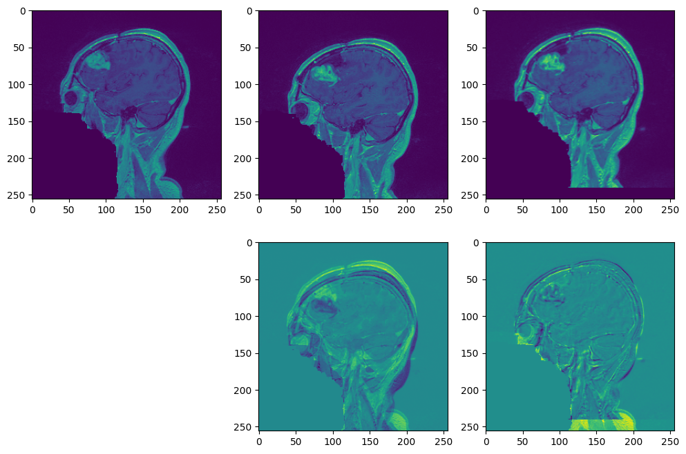

# Proket VITK Morgane Baizeau
## Execution
Ce projet a été construit avec itk version 5.4.0 et vtk version 9.3.0, avec python 3.11

Si des versions compatibles sont installées, il suffit d'executer le fichier main.py.

Il faut fermer la première fenêtre pour voire le second résultat

## Recalage
Le recalage a été fait par recalage par translation comme vu en TP.
C'est une méthode très basique, qui permet un ensemble de recalage assez limité (pas de rotation par example),
mais il est très rapide, et très efficace dans ce cas ci :

à gauche, image 1, milieu, image 2, droite image 2 recalée, et en bas différence avec image 1

## Segmentation
J'ai choisi la segmentation watershed de par sa capacité d'automatisation.
bien que j'ai réussi à identifier et montrer la tumeur dans les deux cas, 
je n'ai pas réussi à automatiquement différencier la tumeur des autres zones segmentées.
dans les images affichés par le programme, j'ai hardcodé les indices de la tumeur.
